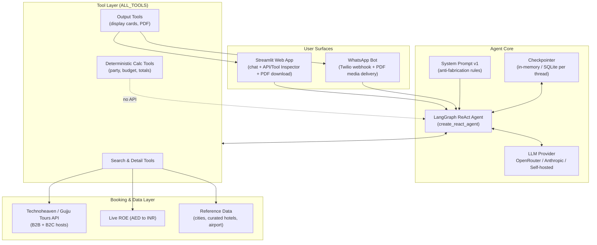
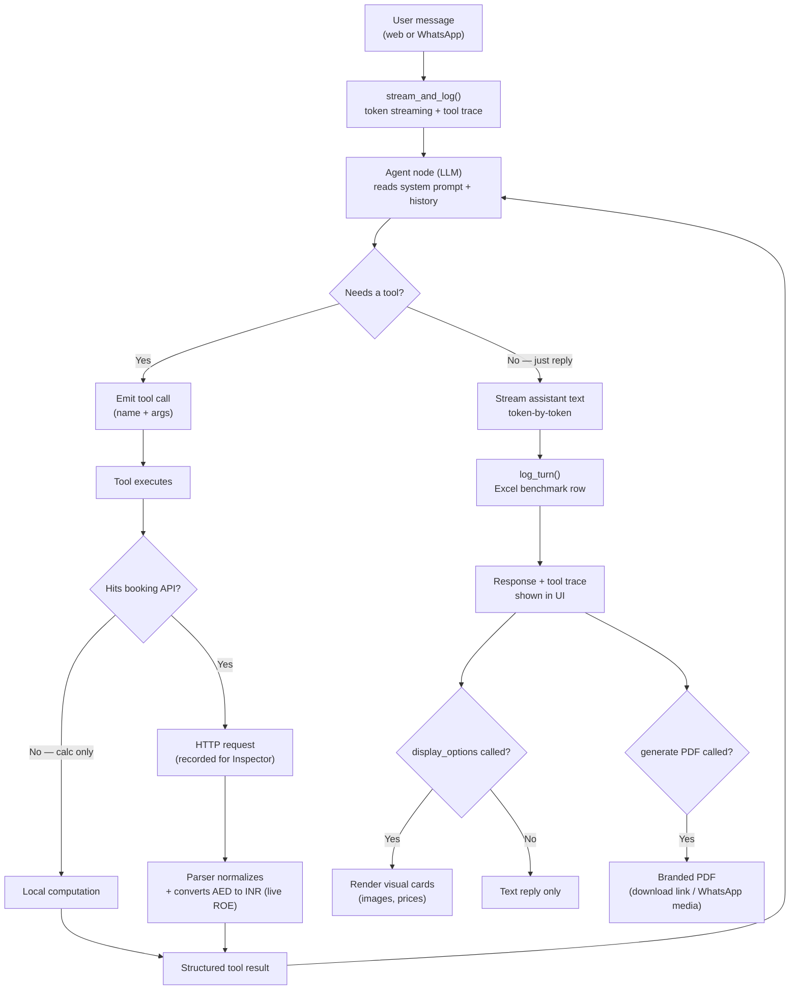
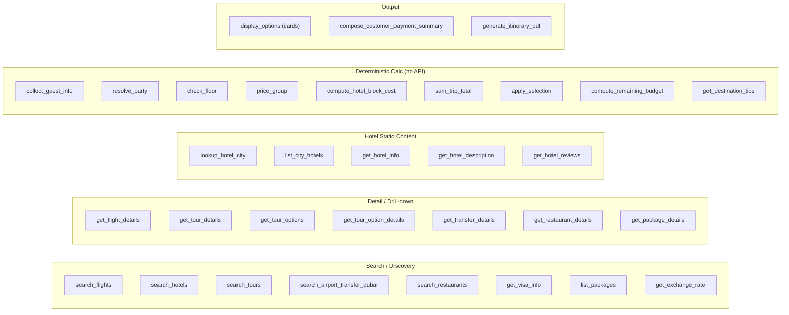
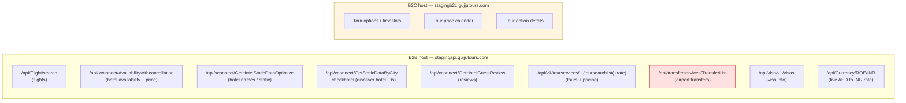

# AI Itinerary Planner — Agent Flow & Current State

This document describes what the system does today: the surfaces, the LangGraph
ReAct agent, the tools it can call, and the underlying Technoheaven (Gujju Tours)
booking APIs each tool hits.

---

## 1. High-level architecture

---

## 2. Per-turn ReAct loop (what happens on each user message)

---

## 3. Tool inventory (grouped by what they do)

---

## 4. Booking API endpoints actually called today

> **Note on transfers (red box):** `TransferList` returns `HTTP 200` only when
> given real Google Place IDs for pickup/drop. Reference data currently uses
> placeholder IDs (`"DXB"` / `"HOTEL"`), so live calls return `404` and the tool
> yields **0 options**. This is the open item flagged in the client email — we
> need the supplier's correct location-ID/Place-ID contract for transfers.

---

## 5. What is built and working today

| Area | Status | Notes |
|------|--------|-------|
| Streamlit web chat | ✅ Working | Streaming replies + API/Tool Inspector (shows every tool + raw HTTP call) |
| WhatsApp bot | ✅ Working | Twilio webhook; delivers PDF as media |
| Flights | ✅ Working | Live search; INR conversion; bogus-fare filter |
| Hotels | ✅ Working | Live discovery of real Dubai inventory + real names + availability pricing |
| Hotel info/reviews/description | ✅ Working | Real address, coords, guest reviews from supplier |
| Tours / activities | ✅ Working | Live search + per-adult pricing; tour options & details |
| Visa | ✅ Working | Live visa info |
| Live ROE (AED→INR) | ✅ Working | Real rate from Currency API, 10-min cache |
| Branded PDF itinerary | ✅ Working | Gujju Tours letterhead; web download + WhatsApp media |
| Budget / party / totals math | ✅ Working | Deterministic tools (no LLM math) |
| **Airport transfers** | ⚠️ **Blocked** | API returns 404 — needs correct Place-ID/location contract from supplier |
| **Booking / payment** | ❌ **Not built** | No booking API integrated yet — needs the supplier's booking flow (see email) |
| Anti-fabrication | ⚠️ Partial | Prompt guardrails in place; current LLM (Mistral) still occasionally invents hotel/flight detail — see Sarvam AI ask |

---

## 6. Known gaps / decisions pending the client

1. **Transfers** — need the supplier's real contract for pickup/drop location
   identifiers (Google Place ID vs. their own location ID).
2. **Booking flow** — the planner produces quotes & itineraries but does **not**
   yet place a booking. We need the supplier's booking API sequence
   (hold → confirm → pay → voucher), required fields, and payment handling.
3. **LLM quality** — the current model fabricates detail under pressure.
   Requesting **Sarvam AI** access to evaluate it as the production model
   (better Indian-English/Hindi handling; provider swap only, no rearchitecture).
