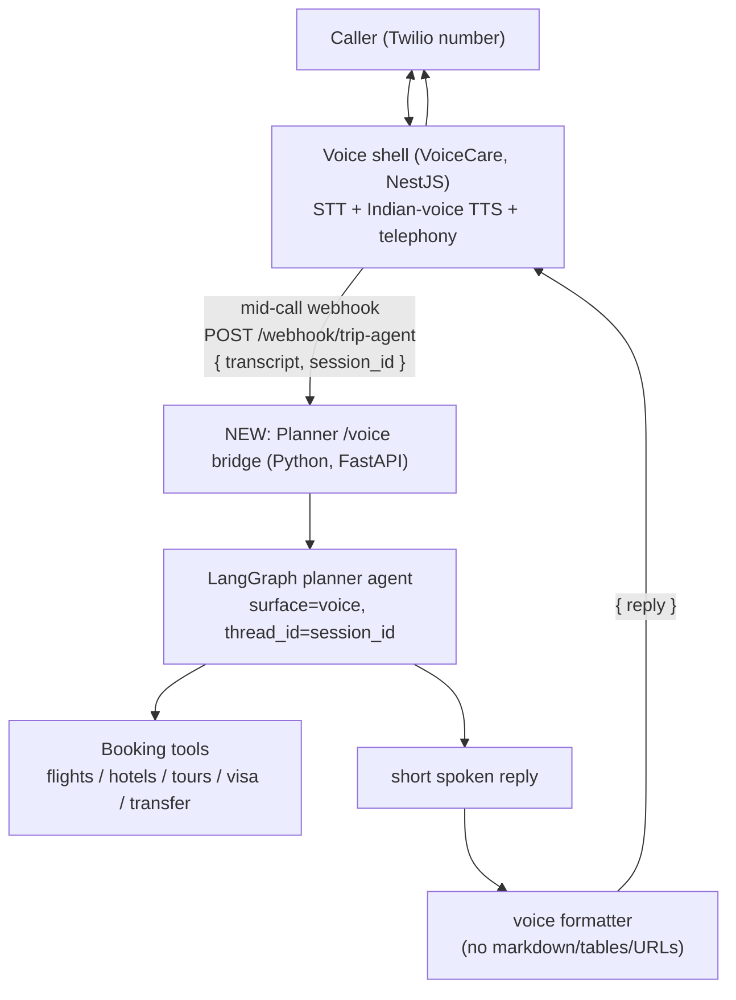

# Voice Agent ↔ Trip Planner — Integration & Repurpose Plan

**Goal:** A caller phones a Twilio number, speaks their trip request ("I want a
4-night Dubai trip for 2 in August"), the voice layer transcribes it, **our
existing planner agent does the thinking** (real flights/hotels/tours, budget,
anti-fabrication), and the voice layer speaks the answer back in an **Indian
voice** (ElevenLabs or Sarvam).

This plan is grounded entirely in the actual code in `voice_agent/voice-care/`
and the planner in this repo. No assumptions.

---

## 1. What we actually have (verified from the code)

### Two codebases
| | Path | Stack | Role |
|---|---|---|---|
| **Planner** (this repo) | `AI_itinerary_planner/` | Python, LangGraph agent | The brain. Already has flights/hotels/tours/visa/transfer tools, budget math, anti-fabrication prompt, WhatsApp + Streamlit surfaces. |
| **Voice** | `voice_agent/voice-care/` | NestJS (API) + `voicecare-ui` (frontend) | Telephony shell — dials via Vapi/ElevenLabs over a Twilio number, STT, TTS, call logging. Currently a **healthcare** product ("VoiceCare"). |

### How the voice shell gets its "brain" today (two patterns already in code)
- **Vapi** — `vapi.provider.ts` hands a system prompt + model to Vapi; **Vapi's
  own LLM** answers every turn. Our backend only sees the transcript *after* the
  call ends (`POST /webhook/vapi` end-of-call-report). The brain is inside Vapi.
- **ElevenLabs** — `webhooks.controller.ts` exposes
  `GET /webhook/patient-data/:phone` described as *"Called by ElevenLabs agent
  DURING a live call to fetch patient context."* **This mid-call webhook is the
  exact mechanism we want** — the voice agent calls our backend live, mid-call,
  to get an answer.

### The Indian voice is already a parameter
- Vapi: `assistantOverrides.voice = { voiceId, provider: '11labs' }`
  (`vapi.provider.ts:210`). ElevenLabs Indian voice = a `voiceId`. **Voice swap =
  config, not code.**
- ElevenLabs SDK already imported (`@elevenlabs/elevenlabs-js`).

### Healthcare coupling (what "remove healthcare" touches)
Patients, clinics, conditions, medications, billing, GHL (GoHighLevel CRM),
scheduler, clinical flag regexes, 5 clinical agent prompts. Found in:
`patients/`, `clinics/`, `agent-prompts.config.ts`, `ghl/`, `billing/`,
`scheduler/`, `alert-config/`, `call-logs` (clinical flags), and the Prisma
schema.

---

## 2. Chosen architecture (best practice for "voice talks to our agent")

**The planner is the brain. The voice shell does telephony + STT + Indian TTS
only.** They connect over HTTP via a single mid-call webhook — the same pattern
already proven by `/webhook/patient-data`.

**Why this over Vapi-as-Custom-LLM:** reuses the webhook pattern already in the
code; keeps our planner (with all the anti-fabrication work) as the single
source of truth; avoids a provider's LLM paraphrasing/fabricating trip data.
Provider-agnostic — ElevenLabs or Vapi can both call the same webhook.

---

## 3. Work plan

### Phase A — Planner side (this repo): add a `voice` surface
Small, isolated, testable. **Does not touch the voice repo.**

1. `prompts/voice_addendum.md` — speech rules: 1–3 short sentences, no tables /
   markdown / emoji / URLs, prices spoken as words ("about forty-two thousand
   rupees"), one question per turn, "I'll send the full details to your WhatsApp."
   Mirrors the existing `whatsapp_addendum.md`.
2. `agent.py` — wire `surface="voice"` into `load_system_prompt` (one branch,
   like the existing `whatsapp` branch).
3. `surfaces/voice_app.py` — FastAPI bridge:
   - `POST /voice` — body `{ transcript, session_id }` → run
     `invoke_and_log(agent, surface="voice", thread_id=session_id)` → return
     `{ reply }` cleaned for speech.
   - `format_for_voice()` — hard strip of `* # | _`, markdown, and any `http…`
     URL so nothing un-speakable reaches TTS.
   - `/health`.
4. `tests/test_voice.py` — formatter guarantees, one end-to-end turn, thread
   isolation per `session_id`.

### Phase B — Voice side (`voice-care`): strip healthcare, point at planner
1. **Replace the brain hook:** add `GET/POST /webhook/trip-agent` (modeled on
   `patient-data`) that calls the Phase-A `/voice` bridge and returns the spoken
   reply. Configure the ElevenLabs/Vapi assistant to call it mid-call.
2. **Replace prompts:** swap `agent-prompts.config.ts` clinical modes for ONE
   travel concierge prompt (greeting + "how can I help plan your trip?"). The
   detailed planning logic stays in our planner — this prompt only needs to
   route the caller's words to the webhook and speak results.
3. **Strip healthcare domain:** remove/neutralize `patients`, `clinics`,
   `medications`, `conditions`, clinical flag regexes, `ghl/`, `alert-config/`,
   and the medical `scheduler`. Replace the patient/clinic data model with a
   minimal `caller`/`session` (phone + session_id) — enough to key conversation
   memory.
4. **Indian voice:** set the assistant `voiceId` to an ElevenLabs Indian voice
   (and/or wire Sarvam). Config-level; A/B both.
5. **UI (`voicecare-ui`):** retarget the clinical screens to travel (or hide
   them initially). Scope TBD after we open the UI.

### Phase C — Wiring & deploy
- Decide hosting: planner `/voice` bridge can ride the existing FastAPI app or
  deploy standalone; the voice shell already deploys via `docker-compose.yml`.
- Set env: planner URL in the voice shell; Indian `voiceId`; provider keys.
- End-to-end test call on the Twilio number.

---

## 4. Open questions to resolve before/within each phase
1. **Session key:** Vapi `call.id` / ElevenLabs `conversation_id` as
   `thread_id`? (Per-call memory.) Or key by caller phone for cross-call
   continuity? — affects Phase A `/voice` + Phase B webhook.
2. **Sarvam access:** ElevenLabs works today; Sarvam needs the API key we
   already flagged to request from the client. Build ElevenLabs-first, add
   Sarvam when access lands.
3. **UI scope:** how much of `voicecare-ui` to repurpose now vs. later
   (needs a read of that folder).
4. **Outbound vs inbound:** VoiceCare today is *outbound* (it dials patients).
   A trip caller is likely *inbound* (caller dials in). Confirm direction — it
   changes the Twilio/Vapi number config (inbound assistant binding).

---

## 5. Suggested order of execution
1. **Phase A** first — it's self-contained, fully testable in this repo, and
   makes the planner voice-ready without depending on the voice repo.
2. Read `voicecare-ui` + confirm the 4 open questions.
3. **Phase B** strip + rewire.
4. **Phase C** deploy + live call.

> Recommendation: start with **Phase A** now (low risk, no cross-repo coupling),
> and in parallel resolve the 4 open questions for Phase B.
